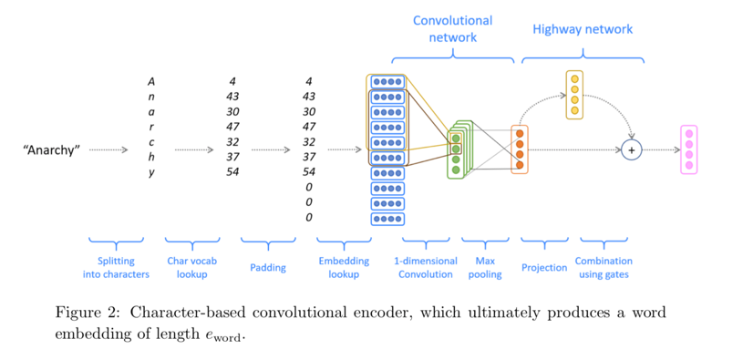

# NMT-Character-Based-CNN-LSTM
In [Neuratl-Machine-Translation-RNN](https://github.com/shashankvmaiya/Neural-Machine-Translation-RNN), we used a simple lookup method to get the representation of the word. If the word is not in our pre-defined vocabulary, then it is represnted as the <UNK> token (which has its own embedding). This NMT model treats the translation problem at a word level throughout. Here we obtain the word embedding using a Character-based convolutional encoder. The NMT system is depicted in the below figure 

